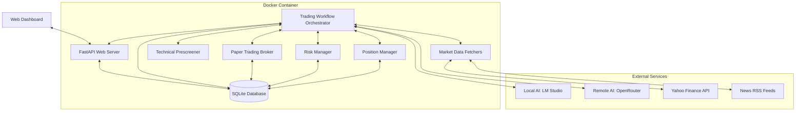
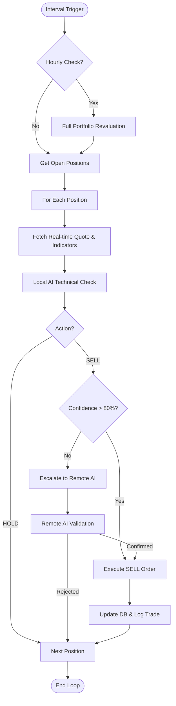
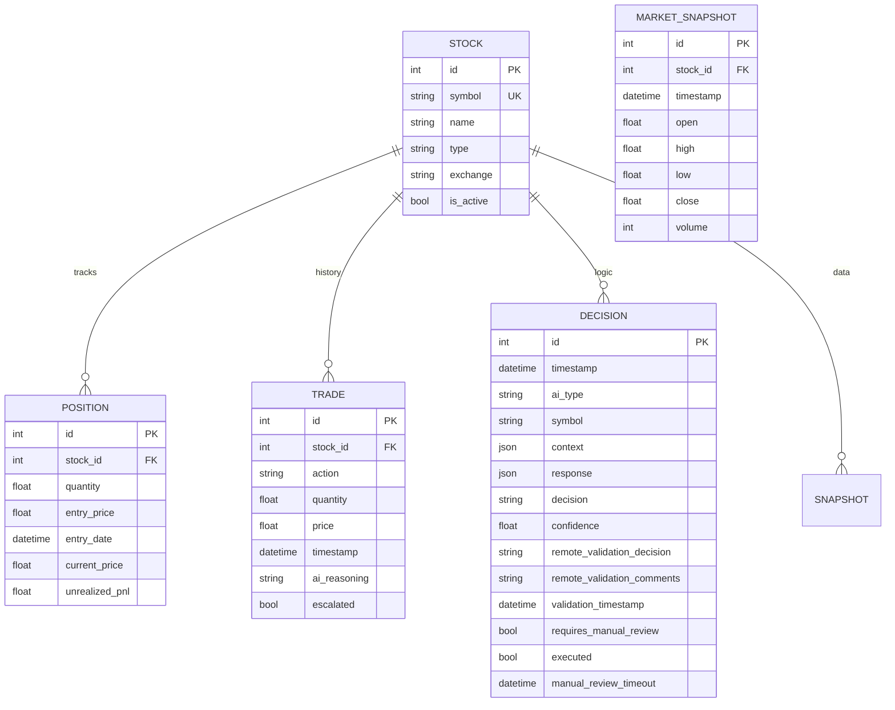

# AI Stock Trader - Architecture Design

**Version:** 1.0.2
**Last Updated:** 2026-01-01
**Status:** Production-Ready
**Target Market:** London Stock Exchange (LSE) / FTSE 100

## 1. System Overview
The AI Stock Trader is an autonomous trading system optimized for the London Stock Exchange. It employs a dual-tier AI architecture:
- **Local AI (LM Studio)**: Handles high-frequency monitoring and technical analysis of open positions to minimize API costs and ensure low-latency response.
- **Remote AI (OpenRouter/Grok-4)**: Performs deep market research, fundamental analysis, and final trade validation using real-time internet data.

The system is designed to run in a containerized environment, providing a live web dashboard for portfolio tracking and manual oversight.

## 2. High-Level Architecture


## 3. Application Workflow

### 3.1 Startup Analysis Flow
When the bot starts (either `--web` or bot mode), it **ALWAYS** performs a comprehensive market sweep.

### Key Behaviors:
- **Analysis runs ALWAYS**: Both web mode (`--web`) and bot mode execute startup analysis
- **Remote validation ALWAYS happens**: Remote AI validation is NOT optional - it checks every BUY and SELL recommendation
- **BUY once per day rule**: Each symbol can only be bought once per calendar day to prevent over-trading
- **Remote AI fallback**: If local AI returns no BUY recommendations, the system queries remote AI for additional opportunities
- **Paper mode**: Trades execute automatically after validation
- **Live mode**: Manual review flag is set but trades don't auto-execute (require user approval)
- **Web mode**: Web server starts after analysis for manual review
- **Bot mode**: Monitoring loop runs after analysis

```mermaid
sequenceDiagram
    participant Bot as Main Bot
    participant Scr as Prescreener
    participant Mkt as Market Data
    participant LAI as Local AI (LMS)
    participant RAI as Remote AI (OR)
    participant Brk as Broker

    Bot->>Mkt: Get LSE Market Status
    Bot->>Scr: Prescreen 100 FTSE 100 Stocks
    Scr->>Mkt: Fetch Technical Indicators
    Mkt-->>Scr: Price, RSI, MACD, SMA
    Scr-->>Bot: Filtered "Passed" Stocks

    Bot->>Mkt: Fetch Targeted Ticker News
    Bot->>LAI: Analyze Market with Tools & Vision
    LAI-->>Bot: Buy Recommendations

    alt No BUY Recommendations from Local AI
        Bot->>RAI: Request Market Recommendations
        RAI-->>Bot: Additional Recommendations
    end

    loop For Each Recommendation
        alt rec["action"] in ["BUY", "SELL"] and rec["confidence"] > 0.8
            Bot->>RAI: Validate Trade Decision (ALWAYS done)
            RAI-->>Bot: PROCEED / MODIFY / REJECT
        alt PROCEED
            alt Paper Mode
                alt Buy Action
                    Bot->>Brk: Execute Paper Trade
                else Sell Action
                    Bot->>Brk: Execute Paper Trade
            else Live Mode
                alt Buy Action
                    Bot->>DB: Log Trade with manual_review_required flag
                else Sell Action
                    Bot->>DB: Log Trade with manual_review_required flag
        end
    end
```

### 3.2 Intraday Monitoring Loop
The bot runs a continuous monitoring loop (default every 5 minutes) to manage open positions. Additionally, it performs a full portfolio revaluation every hour.



**Hourly Revaluation**: Every hour, the bot performs a deep analysis of all open positions, fetching comprehensive historical data and escalating to Remote AI for validation, regardless of local AI confidence.

## 4. Web Dashboard & API

### 4.1 FastAPI Endpoints
The application includes an internal web server exposed on port **8000**.

| Endpoint | Method | Description |
|----------|--------|-------------|
| `/` | GET | Interactive Dashboard (HTML/Tailwind) |
| `/api/status` | GET | Real-time JSON status of positions and AI decisions |

### 4.2 Dashboard Layout
The dashboard provides real-time visibility into the bot's operations:
1. **Overview Cards**: Displays Total Portfolio Value (GBP), Cash Balance, and Unrealized P&L.
2. **Pending Decisions**: Shows AI decisions that require manual review or are awaiting execution.
3. **All AI Recommendations**: A historical log of every decision made by the AI (Local and Remote).
4. **Active Positions**: Current holdings with live price updates and individual P&L tracking.

## 5. Core Components

### 5.1 Technical Prescreener
Filters the FTSE 100 universe down to a manageable set of high-probability setups using:
- **RSI (14)**: Identifies overbought/oversold conditions (Threshold: < 70).
- **MACD**: Confirms trend momentum (Threshold: > 0).
- **SMA (50/200)**: Ensures price is trending above short-term support.
- **Rule**: A stock must pass at least 2 of 3 technical criteria to be sent to the AI for deep analysis.
- **Top 10 Selection**: The prescreened stocks are ranked by technical score, and only the top 10 are sent to AI for deep analysis.

### 5.2 AI Layer
- **Tool Calling**: The AI has access to `get_ticker_news`, `get_price_history`, and `get_current_quote`.
- **Vision Integration**: The bot generates local charts using `matplotlib`, converts them to Base64, and sends them to the local AI for visual pattern recognition.
- **Robust Response Parsing**:
    - Implements `_clean_json_response` to strip internal AI reasoning (e.g., `[THINK]` blocks) and extract valid JSON objects from verbose outputs.
    - Uses strict prompt instructions to ensure actionable recommendations are placed in a structured `recommendations` list rather than buried in summaries.
- **Retry Mechanism**: Implements exponential backoff (1s, 2s, 3s) for AI API calls to handle transient network issues.
- **Remote AI Fallback**: When local AI returns no BUY recommendations, the system automatically escalates to remote AI for additional market analysis via `request_remote_recommendations()`.
- **Remote Only Mode**: When `REMOTE_ONLY_MODE=true`, the system skips local AI analysis entirely and uses only remote AI.

### 5.3 Database Schema (SQLite)


## 6. Operational Details

### 6.1 Market Data Sources
- **Yahoo Finance API**: Primary data source for real-time quotes, historical OHLCV data, and ticker-specific news. Used for all market data operations.
- **Alpha Vantage API**: Alternative data fetcher implementation available but not currently used in production workflows. Can be enabled by modifying the workflow initialization.
- **RSS News Feeds**: General market news from multiple sources including Yahoo News UK, Yahoo Finance, BBC UK, and BBC Business.
- **Yahoo News**: Ticker-specific news fetched via Yahoo Finance API for targeted analysis.

### 6.2 API Authentication
- **OpenRouter**: Requires a valid API key (`OPENROUTER_API_KEY`). This key is used for the expensive high-level reasoning and final trade safety checks.
- **LM Studio**: Assumes a local server running on `http://localhost:1234/v1`. No API key is typically required for local instances.
- **Remote Only Mode**: Set `REMOTE_ONLY_MODE=true` to skip local AI analysis and use only remote AI. Useful when remote AI is cheap enough or local AI is unavailable.

### 6.3 Market Hours (LSE)
- **Hours**: 08:00 to 16:30 GMT, Monday to Friday.
- **Handling**: The bot checks `get_market_status()`. If the market is closed, it continues to analyze and "plan" positions (stored as `PENDING`), but will not attempt to execute trades until the next market open.
- **Test Mode (Market Hour Override)**: Using the `--test-mode` command-line flag enables `IGNORE_MARKET_HOURS`. This forces `get_market_status()` to always return `is_open=True`, allowing developers to test the full buy/sell/hold execution logic even when the LSE is closed.

### 6.4 Position Sizing Formula
The bot uses a risk-controlled sizing model:
- **Default Size**: 5% of total portfolio value per trade.
- **Calculation**: `Quantity = (Total_Balance * Size_Percentage) / Current_Price`.
- **Risk Limit**: The `RiskManager` prevents any single position from exceeding the configured maximum exposure (default 10%).

### 6.5 Data Persistence
- **SQLite**: Stores the source of truth for stocks, trade history, and AI decisions.
- **portfolio.json**: A lightweight backup file used specifically for tracking the `cash_balance` across restarts, ensuring the paper trading account remains consistent.

### 6.6 Monitoring Frequency
- **Default**: 300 seconds (5 minutes).
- **Rationale**: Balancing real-time responsiveness with local compute usage and API rate limits. This frequency is high enough to catch intraday trend shifts while allowing the AI enough time to process full market sweeps.

### 6.7 BUY Once Per Day Rule
- **Purpose**: Prevents over-trading by limiting each symbol to one BUY per calendar day.
- **Implementation**: The system checks the `trades` table for any BUY action on a symbol with timestamp >= today's date (midnight UTC).
- **Behavior**: If a BUY was already executed for a symbol today, subsequent BUY recommendations are skipped with log message: "Ignoring BUY for {symbol} (already bought today)".
- **SELL Exception**: SELL recommendations can still be executed at any time, regardless of the BUY limit.

### 6.8 Remote AI Fallback
- **Trigger**: If local AI returns no BUY recommendations (with >= 80% confidence), the system automatically queries remote AI for additional trading opportunities.
- **Implementation**: After local AI analysis completes, the system checks `recommendations` for any `action == "BUY"` with `confidence >= 0.8`. If none found, it calls `decision_engine.request_remote_recommendations()` with the same prescreened stock data.
- **Merging**: Remote AI recommendations are appended to the local recommendations list for unified processing.
- **Error Handling**: If remote AI query fails, the system continues with only local recommendations.
- **Skip Validation**: Remote AI recommendations are marked with `from_remote=True` and skip the additional `validate_with_remote_ai()` call since they were already validated by remote AI.

### 6.9 Remote Only Mode
- **Setting**: `REMOTE_ONLY_MODE=true` in `.env`
- **Purpose**: Skip local AI analysis entirely and use only remote AI for market analysis.
- **Use Case**: Useful when local AI is unavailable or when remote AI is cheap enough to use for primary analysis.
- **Behavior**: When enabled, the system skips local AI analysis in `startup_analysis_with_prescreening()` and goes directly to `request_remote_recommendations()`.

## 6.10 Testing Requirements

Per `tests/test_trading_modes.py`, the following behaviors MUST be tested:

1. **Analysis Always Runs**: `test_startup_analysis_always_runs()`
   - Verifies that `workflow.run_startup_analysis()` exists
   - Analysis must run in both web mode and bot mode

2. **Remote Validation Always Happens**: `test_remote_validation_always_happens()`
   - Verifies that `decision_engine.validate_with_remote_ai()` exists
   - Remote AI validation is NOT optional
   - Must validate every BUY and SELL recommendation regardless of mode

3. **Paper Mode Auto-Executes Trades**:
   - In `workflows.py`: `if validation["decision"] == "PROCEED":` calls `self._execute_buy()`
   - In paper mode, no manual approval required
   - Tests verify this behavior through execution flow

4. **Live Mode Requires Manual Review**:
   - Live mode trades set `requires_manual_review = True` for BUY and SELL actions
   - Live mode trades are blocked from auto-execution
   - Users must approve via web dashboard

5. **Web Mode Behavior**:
   - Web mode runs analysis first
   - Then starts web server
   - Does NOT run monitoring loop
   - Manual review available on dashboard

6. **Bot Mode Behavior**:
   - Bot mode runs analysis first
   - Then runs monitoring loop
   - Trades execute automatically in paper mode
   - Manual review required in live mode

## 7. Market Data & News Integration

### 7.1 Market Data Sources
The system uses Yahoo Finance as the primary market data provider:
- **Real-time Quotes**: Current price, change, volume, and timestamp
- **Historical Data**: OHLCV data for technical analysis (configurable periods: 1mo, 3mo, 6mo, 1y)
- **Market Status**: Determines if LSE market is open (08:00-16:30 GMT, Mon-Fri)
- **Ticker-specific News**: Recent news articles for individual stocks

### 7.2 News Sources
The system fetches news from multiple RSS feeds:
- **Yahoo News UK**: General UK market news
- **Yahoo Finance**: Financial market news
- **BBC UK**: General UK news
- **BBC Business**: Business and economic news

News is used in two ways:
1. **General Market Context**: Top headlines from all feeds inform the AI about overall market sentiment
2. **Targeted Stock News**: Specific news for top 10 prescreened stocks is fetched via Yahoo Finance API

## 8. Containerization & Deployment

### 8.1 Docker Configuration
- **Base Image**: `python:3.12-slim`.
- **Volume**: `/app/data` is mounted to persist the database and portfolio files.
- **Port**: 8000 (Dashboard).

### 8.2 Deployment Command
```bash
docker-compose up --build
```

## 9. Error Handling
- **Graceful Degradation**: If the Remote AI is unavailable, the bot will log the error and default to `PROCEED` for safety, or proceed with high-confidence Local AI decisions if configured.
- **Data Integrity**: Uses async database transactions to ensure trade logs and position updates are atomic.

## 10. Version History

### Version 1.0.2 (2026-01-01)
- **Market Data Sources**: Updated to reflect Yahoo Finance as primary data source
- **Alpha Vantage**: Clarified that Alpha Vantage fetcher exists but is not used in production workflows
- **News Sources**: Updated to reflect actual RSS feeds used (Yahoo, BBC)
- **Database Schema**: Updated to include all actual fields and relationships (MarketSnapshot, AIDecision fields)
- **AI Architecture**: Updated to reflect LM Studio (not Ollama) as local AI provider
- **Workflow**: Updated to reflect hourly portfolio revaluation and top 10 stock selection
- **Testing**: Updated to reflect that both BUY and SELL recommendations require remote validation
- **Remote Only Mode**: Clarified behavior when enabled
- **FTSE 100 Coverage**: Corrected to reflect all 100 stocks monitored
- **Dashboard**: Updated "Planned Positions" to "Pending Decisions"

### Version 1.0.1
- Initial production-ready version

## 11. Key Implementation Notes

### Alpha Vantage Status
While the codebase includes a complete `AlphaVantageFetcher` implementation in `src/market/data_fetcher.py`, it is **not currently used** in production workflows. The system uses `YahooFinanceFetcher` exclusively for market data. Alpha Vantage could be enabled by modifying the workflow initialization in `src/orchestration/workflows.py` line 40.

### FTSE 100 Coverage
The system monitors all 100 FTSE 100 stocks (not 98 as previously stated), with a hardcoded list in `workflows.py` lines 192-291.

### Local AI Provider
The system uses LM Studio (not Ollama) as the local AI provider, configured via `LM_STUDIO_API_URL` and `LM_STUDIO_MODEL` environment variables.

### Hourly Portfolio Revaluation
The monitoring loop includes an hourly full portfolio revaluation feature that performs deep analysis on all open positions, fetching comprehensive historical data and escalating to Remote AI for validation regardless of local AI confidence levels.

### Top 10 Stock Selection
During startup analysis, the prescreened stocks are ranked by technical score, and only the top 10 are sent to the AI for deep analysis with targeted news fetching.
