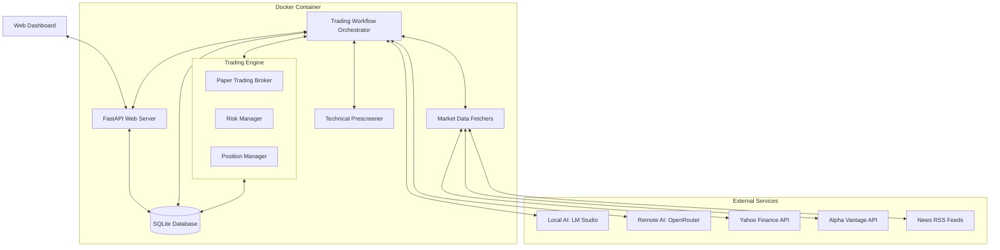
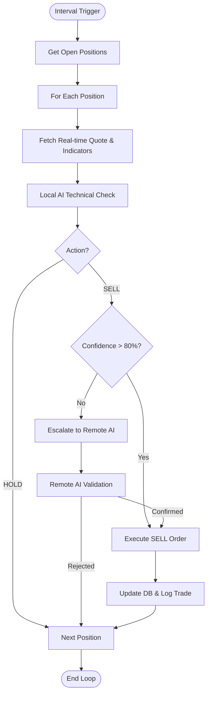
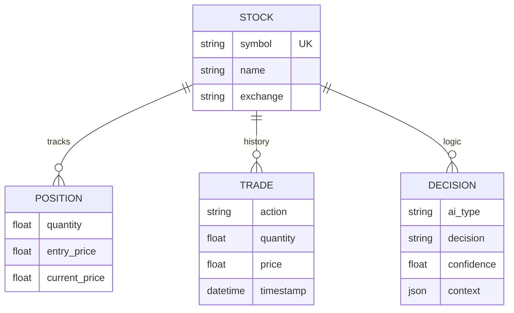

# AI Stock Trader - Architecture Design

**Version:** 1.0.1  
**Last Updated:** 2026-01-01  
**Status:** Production-Ready  
**Target Market:** London Stock Exchange (LSE) / FTSE 100

## 1. System Overview
The AI Stock Trader is an autonomous trading system optimized for the London Stock Exchange. It employs a dual-tier AI architecture:
- **Local AI (LM Studio/Ollama)**: Handles high-frequency monitoring and technical analysis of open positions to minimize API costs and ensure low-latency response.
- **Remote AI (OpenRouter/Grok-4)**: Performs deep market research, fundamental analysis, and final trade validation using real-time internet data.

The system is designed to run in a containerized environment, providing a live web dashboard for portfolio tracking and manual oversight.

## 2. High-Level Architecture


## 3. Application Workflow

### 3.1 Startup Analysis Flow
When the bot starts (either `--web` or bot mode), it **ALWAYS** performs a comprehensive market sweep.

### Key Behaviors:
- **Analysis runs ALWAYS**: Both web mode (`--web`) and bot mode execute startup analysis
- **Remote validation ALWAYS happens**: Remote AI validation is NOT optional - it checks every BUY and SELL recommendation
- **Paper mode**: Trades execute automatically after validation
- **Live mode**: Manual review flag is set but trades don't auto-execute (require user approval)
- **Web mode**: Web server starts after analysis for manual review
- **Bot mode**: Monitoring loop runs after analysis

```mermaid
sequenceDiagram
    participant Bot as Main Bot
    participant Scr as Prescreener
    participant Mkt as Market Data
    participant LAI as Local AI (LMS)
    participant RAI as Remote AI (OR)
    participant Brk as Broker

    Bot->>Mkt: Get LSE Market Status
    Bot->>Scr: Prescreen 98 FTSE 100 Stocks
    Scr->>Mkt: Fetch Technical Indicators
    Mkt-->>Scr: Price, RSI, MACD, SMA
    Scr-->>Bot: Filtered "Passed" Stocks

    Bot->>Mkt: Fetch Targeted Ticker News
    Bot->>LAI: Analyze Market with Tools & Vision
    LAI-->>Bot: Buy Recommendations

    loop For Each Recommendation
        alt rec["action"] in ["BUY", "SELL"] and rec["confidence"] > 0.8
            Bot->>RAI: Validate Trade Decision (ALWAYS done)
            RAI-->>Bot: PROCEED / MODIFY / REJECT
        alt PROCEED
            alt Paper Mode
                alt Buy Action
                    Bot->>Brk: Execute Paper Trade
                else Sell Action
                    Bot->>Brk: Execute Paper Trade
            else Live Mode
                alt Buy Action
                    Bot->>DB: Log Trade with manual_review_required flag
                else Sell Action
                    Bot->>DB: Log Trade with manual_review_required flag
        end
    end
```

### 3.2 Intraday Monitoring Loop
The bot runs a continuous monitoring loop (default every 5 minutes) to manage open positions.



## 4. Web Dashboard & API

### 4.1 FastAPI Endpoints
The application includes an internal web server exposed on port **8000**.

| Endpoint | Method | Description |
|----------|--------|-------------|
| `/` | GET | Interactive Dashboard (HTML/Tailwind) |
| `/api/status` | GET | Real-time JSON status of positions and AI decisions |

### 4.2 Dashboard Layout
The dashboard provides real-time visibility into the bot's operations:
1. **Overview Cards**: Displays Total Portfolio Value (GBP), Cash Balance, and Unrealized P&L.
2. **Planned Positions**: Shows stocks identified by the AI as potential buys, awaiting market open or execution.
3. **All AI Recommendations**: A historical log of every decision made by the AI (Local and Remote).
4. **Active Positions**: Current holdings with live price updates and individual P&L tracking.

## 5. Core Components

### 5.1 Technical Prescreener
Filters the FTSE 100 universe down to a manageable set of high-probability setups using:
- **RSI (14)**: Identifies overbought/oversold conditions (Threshold: < 70).
- **MACD**: Confirms trend momentum (Threshold: > 0).
- **SMA (50/200)**: Ensures price is trending above short-term support.
- **Rule**: A stock must pass at least 2 of 3 technical criteria to be sent to the AI for deep analysis.

### 5.2 AI Layer
- **Tool Calling**: The AI has access to `get_ticker_news`, `get_price_history`, and `get_current_quote`.
- **Vision Integration**: The bot generates local charts using `matplotlib`, converts them to Base64, and sends them to the local AI for visual pattern recognition.
- **Robust Response Parsing**:
    - Implements `_clean_json_response` to strip internal AI reasoning (e.g., `[THINK]` blocks) and extract valid JSON objects from verbose outputs.
    - Uses strict prompt instructions to ensure actionable recommendations are placed in a structured `recommendations` list rather than buried in summaries.
- **Retry Mechanism**: Implements exponential backoff (1s, 2s, 3s) for AI API calls to handle transient network issues.

### 5.3 Database Schema (SQLite)


## 6. Operational Details

### 6.1 API Authentication
- **OpenRouter**: Requires a valid API key (`OPENROUTER_API_KEY`). This key is used for the expensive high-level reasoning and final trade safety checks.
- **LM Studio**: Assumes a local server running on `http://localhost:1234/v1`. No API key is typically required for local instances.

### 6.2 Market Hours (LSE)
- **Hours**: 08:00 to 16:30 GMT, Monday to Friday.
- **Handling**: The bot checks `get_market_status()`. If the market is closed, it continues to analyze and "plan" positions (stored as `PENDING`), but will not attempt to execute trades until the next market open.

### 6.3 Position Sizing Formula
The bot uses a risk-controlled sizing model:
- **Default Size**: 5% of total portfolio value per trade.
- **Calculation**: `Quantity = (Total_Balance * Size_Percentage) / Current_Price`.
- **Risk Limit**: The `RiskManager` prevents any single position from exceeding the configured maximum exposure (default 10%).

### 6.4 Data Persistence
- **SQLite**: Stores the source of truth for stocks, trade history, and AI decisions.
- **portfolio.json**: A lightweight backup file used specifically for tracking the `cash_balance` across restarts, ensuring the paper trading account remains consistent.

### 6.5 Monitoring Frequency
- **Default**: 300 seconds (5 minutes).
- **Rationale**: Balancing real-time responsiveness with local compute usage and API rate limits. This frequency is high enough to catch intraday trend shifts while allowing the AI enough time to process full market sweeps.

## 6.6 Testing Requirements

Per `tests/test_trading_modes.py`, the following behaviors MUST be tested:

1. **Analysis Always Runs**: `test_startup_analysis_always_runs()`
   - Verifies that `workflow.run_startup_analysis()` exists
   - Analysis must run in both web mode and bot mode

2. **Remote Validation Always Happens**: `test_remote_validation_always_happens()`
   - Verifies that `decision_engine.validate_with_remote_ai()` exists
   - Remote AI validation is NOT optional
   - Must validate every BUY recommendation regardless of mode

3. **Paper Mode Auto-Executes Trades**:
   - In `workflows.py`: `if validation["decision"] == "PROCEED":` calls `self._execute_buy()`
   - In paper mode, no manual approval required
   - Tests verify this behavior through execution flow

4. **Live Mode Requires Manual Review**:
   - In `decision_engine.py`: `if settings.TRADING_MODE != "paper":` sets `requires_manual_review = True`
   - Live mode trades are blocked from auto-execution
   - Users must approve via web dashboard

5. **Web Mode Behavior**:
   - Web mode runs analysis first
   - Then starts web server
   - Does NOT run monitoring loop
   - Manual review available on dashboard

6. **Bot Mode Behavior**:
   - Bot mode runs analysis first
   - Then runs monitoring loop
   - Trades execute automatically in paper mode
   - Manual review required in live mode

## 7. Containerization & Deployment

### 7.1 Docker Configuration
- **Base Image**: `python:3.12-slim`.
- **Volume**: `/app/data` is mounted to persist the database and portfolio files.
- **Port**: 8000 (Dashboard).

### 7.2 Deployment Command
```bash
docker-compose up --build
```

## 8. Error Handling
- **Graceful Degradation**: If the Remote AI is unavailable, the bot will log the error and default to `HOLD` for safety, or proceed with high-confidence Local AI decisions if configured.
- **Data Integrity**: Uses async database transactions to ensure trade logs and position updates are atomic.
